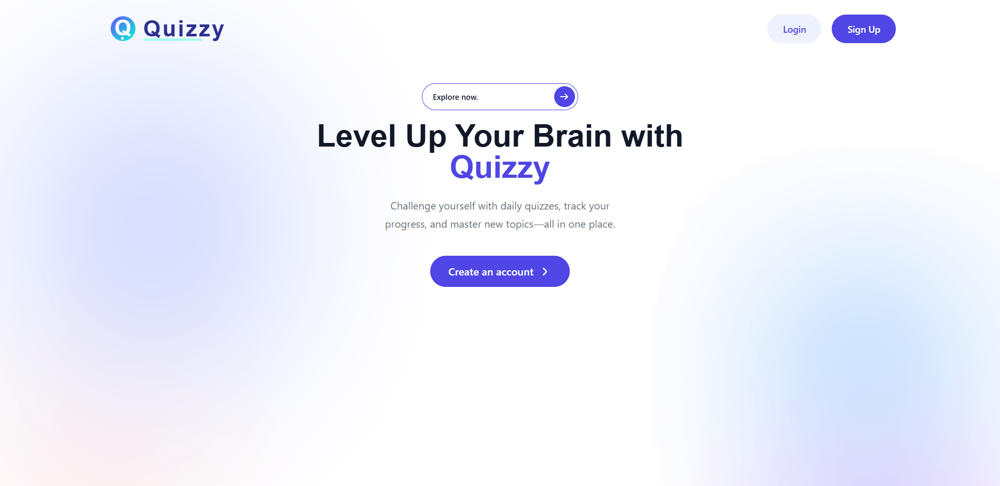
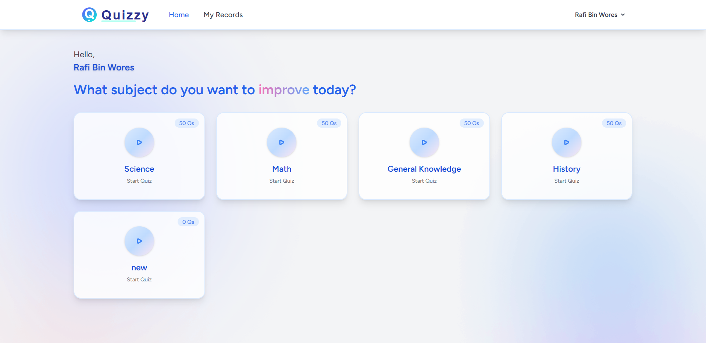
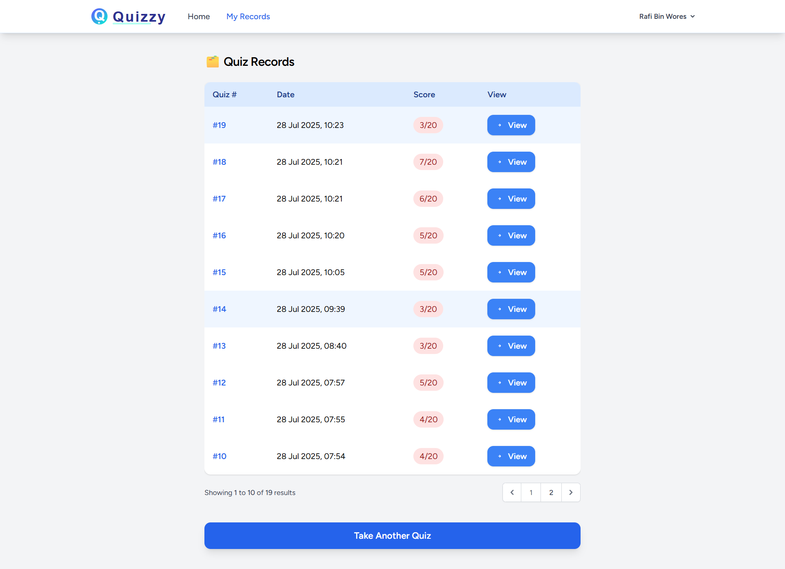

# 🎯 Laravel 12 Quiz Website

[](https://laravel.com)
[](https://php.net)
[](https://mysql.com)
[](LICENSE)

An **interactive quiz platform** built with **Laravel 12** where users can:

* ✍️ Create an account
* 📚 Take quizzes by category
* 📊 Review their past results anytime

---

## 📸 Screenshots

| Home Page                          | Quiz Page                          | Results Page                             |
| ---------------------------------- | ---------------------------------- | ---------------------------------------- |
|  |  |  |


---

## 🚀 Features

* 🔐 **User Authentication** – Secure login & registration
* 📂 **Category-Based Quizzes** – Select quizzes from various categories
* 📜 **Results History** – Track past quiz performances
* 📱 **Responsive Design** – Works on mobile, tablet, and desktop
* ⚡ **Optimized Performance** – Fast and scalable

---

## 🛠 Tech Stack

* **Backend**: Laravel 12 (PHP Framework)
* **Frontend**: Blade Templates + Tailwind CSS / Bootstrap
* **Database**: MySQL / MariaDB
* **Authentication**: Laravel Breeze / Laravel UI
* **Version Control**: Git & GitHub

---

## 📦 Installation

1. **Clone the repository**

   ```bash
   git clone https://github.com/RafiBinWores/quizzy.git
   cd quizzy
   ```

2. **Install dependencies**

   ```bash
   composer install
   npm install && npm run dev
   ```

3. **Setup environment variables**

   * Copy `.env.example` to `.env`
   * Update your database credentials

4. **Generate application key**

   ```bash
   php artisan key:generate
   ```

5. **Run migrations with seed data**

   ```bash
   php artisan migrate
   ```

6. **Start the development server**

   ```bash
   php artisan serve
   ```

7. **Access your app** at [http://localhost:8000](http://localhost:8000)

---

## 🔮 Future Improvements

* ⏱ Timed quizzes
* 🏆 Leaderboard
* 📊 Advanced analytics
* 🖥 Admin panel for quiz management
* 🌐 Multi-language support

---

## 📜 License

This project is licensed under the [MIT License](LICENSE).

---

## ⭐ Support

If you like this project, please give it a star on GitHub!
